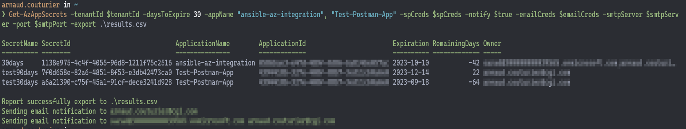
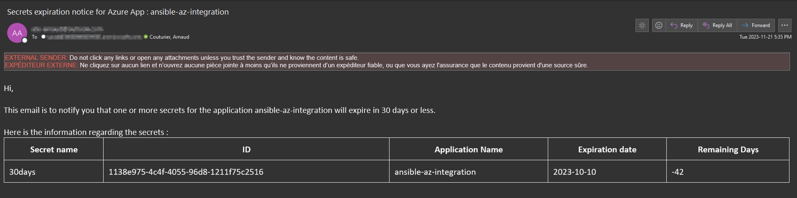

<div align="center">
  
  <h1>Az.Secrets</h1>
  <br/>
</div>
PowerShell module to automate the management of expiring App Registrations and Keyvault secrets in Azure

## Requirements :
-	PowerShell Core version >= 7.3.9
- Microsoft.Graph
- Az.KeyVault
- Az.Accounts
 
The following modules are optional but recommended to allow full usage of the module : 

To send email notifications
- Send-MailKitMessage

To use a local vault for Azure authentication:
- Microsoft.PowerShell.SecretManagement
- Microsoft.PowerShell.SecretStore

## Installation
To install all requirements:  
```
Install-Module @("Microsoft.Graph";"Microsoft.PowerShell.SecretManagement";"Microsoft.PowerShell.SecretStore";"Send-MailKitMessage";“Az.Accounts”;”Az.KeyVault”)
```

Install **Az.Secrets** to one of your **PSModulePath** folder. 

To check valid paths : `$env:PSModulePath -split ';'`

## Usage and Example
Import the module: `Import-Module Az.Secrets` 

Here's an example of a query to get the expiring secrets of specified applications and senting notifications to the recipients inside `$RecipientList` variable :


<div align="center">
  <strong>Console Output</strong>
</div>
<br>
</br>


<div align="center">
  <strong>Email Notification</strong>
</div>
<br>
</br>

For all functions parameters and examples, read [Az.Secrets.psm1](/Az.Secrets/Az.Secrets.psm1).